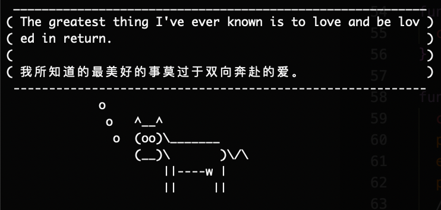

<h1 align="center">Daily Saying</h1>

<p align="center">
  <strong>Fetch a daily saying from iciba.com and output it</strong>
</p>

## 🚧 Install

```shell
npm install -g daily-saying
```

## 🚀 Usage

```shell
Usage
  $ daily-saying [options]

Options
  --line-length, -l   The max length of line
  --help              Show help info

Examples
  $ daily-saying --line-length 56
  $ daily-saying --help
  $ daily-saying --version
```




## 🔖 License

The scripts and documentation in this project are released under the [MIT License](LICENSE)
